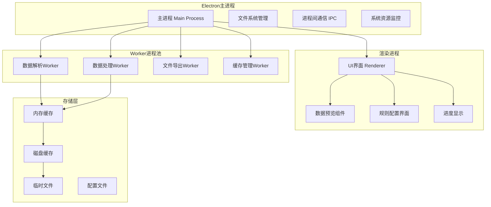

# 设计文档

## 概述

将现有的P_Excel Web应用重构为基于Electron的跨平台桌面应用，以突破浏览器限制，支持GB级别大文件和百万级数据行处理。设计采用主进程+渲染进程+Worker进程的多进程架构，确保UI响应性和数据处理性能。

## 架构

### 整体架构



### 技术栈选择

**桌面应用框架**

- **Electron**: 跨平台桌面应用开发
- **Node.js**: 后端逻辑和文件系统操作
- **原生模块**: 性能关键部分使用C++扩展

**数据处理引擎**

- **Apache Arrow**: 内存列式数据格式，支持大数据处理
- **DuckDB**: 嵌入式分析数据库，支持SQL查询
- **Stream处理**: 流式读取和处理大文件

**UI框架**

- **保留现有**: HTML + CSS + JavaScript
- **daisyUI**: 保持现有UI组件库
- **增强功能**: 添加桌面应用特有的UI元素

**存储方案**

- **SQLite**: 元数据和配置存储
- **文件系统**: 大文件缓存和临时存储
- **内存映射**: 大文件高效访问

## 组件和接口

### 主进程组件

#### 1. 应用管理器 (AppManager)

```javascript
class AppManager {
    constructor() {
        this.configManager = new ConfigManager();
        this.resourceMonitor = new ResourceMonitor();
        this.processManager = new ProcessManager();
    }
    
    // 应用生命周期管理
    async initialize()
    async shutdown()
    
    // 窗口管理
    createMainWindow()
    createWorkerWindow()
    
    // 系统集成
    setupMenus()
    setupProtocols()
}
```

#### 2. 文件系统管理器 (FileSystemManager)

```javascript
class FileSystemManager {
    constructor() {
        this.cacheDir = path.join(os.tmpdir(), 'p-excel-cache');
        this.configDir = path.join(os.homedir(), '.p-excel');
    }
    
    // 大文件处理
    async streamReadFile(filePath, options)
    async createTempFile(data, options)
    async cleanupTempFiles()
    
    // 缓存管理
    async getCacheInfo()
    async clearCache()
    async optimizeCache()
}
```

#### 3. 进程间通信管理器 (IPCManager)

```javascript
class IPCManager {
    constructor() {
        this.channels = new Map();
        this.workerPool = new WorkerPool();
    }
    
    // 通信通道管理
    registerChannel(name, handler)
    sendToRenderer(channel, data)
    sendToWorker(workerId, data)
    
    // 数据传输优化
    async transferLargeData(data, target)
    async streamData(stream, target)
}
```

### 渲染进程组件

#### 1. 主应用控制器 (MainController)

```javascript
class MainController {
    constructor() {
        this.fileManager = new FileManager();
        this.dataManager = new DataManager();
        this.uiManager = new UIManager();
    }
    
    // 保持现有接口兼容性
    async handleFileSelect(files)
    async handleQuickMonthFilter()
    async handleQuickQualityExtract()
    
    // 新增大文件处理
    async handleLargeFileUpload(files)
    async handleBatchProcessing(files, rules)
}
```

#### 2. 数据管理器 (DataManager)

```javascript
class DataManager {
    constructor() {
        this.cache = new DataCache();
        this.processor = new DataProcessor();
        this.validator = new DataValidator();
    }
    
    // 大数据处理
    async loadLargeFile(filePath, options)
    async processInChunks(data, rules, chunkSize)
    async streamProcess(inputStream, rules, outputStream)
    
    // 内存管理
    async optimizeMemoryUsage()
    async getMemoryStats()
}
```

#### 3. UI管理器 (UIManager)

```javascript
class UIManager {
    constructor() {
        this.components = new Map();
        this.eventBus = new EventBus();
    }
    
    // 增强的UI组件
    createLargeDataPreview(data, options)
    createProgressIndicator(type, options)
    createResourceMonitor()
    
    // 桌面应用特有功能
    setupNativeMenus()
    setupSystemTray()
    setupNotifications()
}
```

#### 4. 快捷操作管理器 (QuickActionsManager)

```javascript
class QuickActionsManager {
    constructor() {
        this.actions = new Map();
        this.templates = new Map();
        this.customActions = new Map();
    }
    
    // 内置快捷操作
    registerBuiltinActions() {
        // 时间筛选类
        this.registerAction('filterCurrentMonth', new MonthFilterAction());
        this.registerAction('filterCurrentQuarter', new QuarterFilterAction());
        this.registerAction('filterCurrentYear', new YearFilterAction());
        
        // 质量筛选类
        this.registerAction('extractQualityResources', new QualityResourcesAction());
        this.registerAction('filterHighValueCustomers', new HighValueCustomersAction());
        this.registerAction('detectAnomalies', new AnomalyDetectionAction());
        
        // 数据清理类
        this.registerAction('removeDuplicates', new RemoveDuplicatesAction());
        this.registerAction('fillEmptyValues', new FillEmptyValuesAction());
        this.registerAction('standardizeFormat', new StandardizeFormatAction());
        
        // 数据分析类
        this.registerAction('generateSummary', new GenerateSummaryAction());
        this.registerAction('createPivotTable', new CreatePivotTableAction());
        this.registerAction('calculateCorrelation', new CalculateCorrelationAction());
    }
    
    // 动态加载新操作
    async loadDynamicActions(actionPath)
    registerAction(name, actionInstance)
    executeAction(name, data, options)
    
    // 自定义操作模板
    saveActionTemplate(name, config)
    loadActionTemplate(name)
    deleteActionTemplate(name)
}
```

#### 5. 计算引擎管理器 (CalculationManager)

```javascript
class CalculationManager {
    constructor() {
        this.formulaEngine = new FormulaEngine();
        this.functionRegistry = new FunctionRegistry();
        this.calculationWorker = new CalculationWorker();
    }
    
    // 公式解析和执行
    async parseFormula(formula, context)
    async executeFormula(parsedFormula, data)
    async batchExecuteFormulas(formulas, data)
    
    // 内置函数库
    registerBuiltinFunctions() {
        // 数学函数
        this.registerFunction('SUM', (values) => values.reduce((a, b) => a + b, 0));
        this.registerFunction('AVERAGE', (values) => values.reduce((a, b) => a + b, 0) / values.length);
        this.registerFunction('MAX', (values) => Math.max(...values));
        this.registerFunction('MIN', (values) => Math.min(...values));
        this.registerFunction('COUNT', (values) => values.length);
        
        // 文本函数
        this.registerFunction('CONCAT', (...args) => args.join(''));
        this.registerFunction('LEFT', (text, num) => text.substring(0, num));
        this.registerFunction('RIGHT', (text, num) => text.substring(text.length - num));
        this.registerFunction('MID', (text, start, length) => text.substring(start - 1, start - 1 + length));
        
        // 日期函数
        this.registerFunction('TODAY', () => new Date());
        this.registerFunction('YEAR', (date) => new Date(date).getFullYear());
        this.registerFunction('MONTH', (date) => new Date(date).getMonth() + 1);
        this.registerFunction('DAY', (date) => new Date(date).getDate());
        
        // 逻辑函数
        this.registerFunction('IF', (condition, trueValue, falseValue) => condition ? trueValue : falseValue);
        this.registerFunction('AND', (...conditions) => conditions.every(c => c));
        this.registerFunction('OR', (...conditions) => conditions.some(c => c));
    }
    
    // 自定义函数管理
    registerFunction(name, implementation)
    unregisterFunction(name)
    listFunctions()
    
    // 计算列创建
    async createCalculatedColumn(columnName, formula, dataset)
    async updateCalculatedColumn(columnName, newFormula, dataset)
}
```

### Worker进程组件

#### 1. 数据解析Worker (DataParserWorker)

```javascript
class DataParserWorker {
    constructor() {
        this.parsers = {
            excel: new ExcelParser(),
            csv: new CSVParser(),
            arrow: new ArrowParser()
        };
    }
    
    // 流式解析大文件
    async parseFileStream(filePath, options)
    async parseInChunks(filePath, chunkSize)
    
    // 格式检测和转换
    async detectFormat(filePath)
    async convertToArrow(data, schema)
}
```

#### 2. 数据处理Worker (DataProcessorWorker)

```javascript
class DataProcessorWorker {
    constructor() {
        this.engine = new ProcessingEngine();
        this.cache = new WorkerCache();
    }
    
    // 大数据处理算法
    async filterLargeDataset(data, conditions)
    async sortLargeDataset(data, columns)
    async mergeLargeDatasets(datasets, joinKeys)
    
    // 并行处理
    async processInParallel(data, rules, threadCount)
    async distributeWork(data, workers)
}
```

#### 3. 缓存管理Worker (CacheWorker)

```javascript
class CacheWorker {
    constructor() {
        this.diskCache = new DiskCache();
        this.memoryCache = new MemoryCache();
        this.compression = new CompressionEngine();
    }
    
    // 智能缓存策略
    async cacheData(key, data, options)
    async retrieveData(key, options)
    async evictOldData()
    
    // 压缩和优化
    async compressData(data)
    async optimizeCacheLayout()
}
```

#### 4. 计算引擎Worker (CalculationWorker)

```javascript
class CalculationWorker {
    constructor() {
        this.mathEngine = new MathEngine();
        this.formulaParser = new FormulaParser();
        this.functionLibrary = new FunctionLibrary();
    }
    
    // 数学运算
    async executeFormula(formula, data, context)
    async calculateColumn(expression, dataset)
    async performAggregation(data, aggregateType, column)
    
    // 函数库管理
    registerFunction(name, implementation)
    async loadCustomFunctions()
    validateFormula(formula)
    
    // 批量计算优化
    async batchCalculate(formulas, dataset)
    async parallelCalculate(calculations, threadCount)
}
```

## 数据模型

### 大文件数据模型

```javascript
// 大文件元数据
class LargeFileMetadata {
    constructor(filePath) {
        this.filePath = filePath;
        this.size = 0;
        this.rowCount = 0;
        this.columnCount = 0;
        this.schema = null;
        this.chunks = [];
        this.cacheKeys = [];
        this.lastModified = null;
        this.checksum = null;
    }
}

// 数据块模型
class DataChunk {
    constructor(id, startRow, endRow) {
        this.id = id;
        this.startRow = startRow;
        this.endRow = endRow;
        this.data = null;
        this.cached = false;
        this.cacheKey = null;
        this.compressed = false;
    }
}

// 处理任务模型
class ProcessingTask {
    constructor(type, data, rules) {
        this.id = generateId();
        this.type = type; // 'filter', 'sort', 'merge', 'export'
        this.data = data;
        this.rules = rules;
        this.status = 'pending';
        this.progress = 0;
        this.result = null;
        this.error = null;
        this.startTime = null;
        this.endTime = null;
    }
}
```

### 配置数据模型

```javascript
// 应用配置
class AppConfig {
    constructor() {
        this.performance = {
            maxMemoryUsage: '4GB',
            maxCacheSize: '2GB',
            workerThreads: os.cpus().length,
            chunkSize: 100000,
            enableCompression: true
        };
        
        this.ui = {
            theme: 'light',
            language: 'zh-CN',
            previewRows: 1000,
            enableAnimations: true
        };
        
        this.security = {
            enableEncryption: false,
            autoCleanup: true,
            maxFileSize: '10GB'
        };
    }
}
```

## 错误处理

### 错误分类和处理策略

```javascript
class ErrorHandler {
    constructor() {
        this.errorTypes = {
            FILE_ERROR: 'file',
            MEMORY_ERROR: 'memory',
            PROCESSING_ERROR: 'processing',
            NETWORK_ERROR: 'network',
            SYSTEM_ERROR: 'system'
        };
    }
    
    // 文件错误处理
    handleFileError(error, context) {
        switch (error.code) {
            case 'ENOENT':
                return this.showFileNotFoundDialog(context.filePath);
            case 'EACCES':
                return this.showPermissionErrorDialog(context.filePath);
            case 'EMFILE':
                return this.handleTooManyFilesError();
            default:
                return this.showGenericFileError(error, context);
        }
    }
    
    // 内存错误处理
    handleMemoryError(error, context) {
        // 自动启用磁盘缓存
        this.enableDiskCache();
        // 减少内存使用
        this.optimizeMemoryUsage();
        // 通知用户
        this.showMemoryWarning();
    }
    
    // 处理错误恢复
    async recoverFromError(error, context) {
        const recovery = this.getRecoveryStrategy(error.type);
        return await recovery.execute(context);
    }
}
```

### 错误恢复机制

```javascript
class RecoveryManager {
    constructor() {
        this.strategies = new Map();
        this.setupRecoveryStrategies();
    }
    
    setupRecoveryStrategies() {
        // 内存不足恢复
        this.strategies.set('MEMORY_EXHAUSTED', {
            async execute(context) {
                // 1. 清理缓存
                await this.clearCache();
                // 2. 启用流式处理
                await this.enableStreamProcessing();
                // 3. 减少并发度
                this.reduceParallelism();
                // 4. 重试操作
                return await this.retryOperation(context);
            }
        });
        
        // 文件损坏恢复
        this.strategies.set('FILE_CORRUPTED', {
            async execute(context) {
                // 1. 尝试部分恢复
                const partialData = await this.recoverPartialData(context.filePath);
                // 2. 提供用户选择
                const userChoice = await this.showRecoveryOptions(partialData);
                // 3. 执行用户选择
                return await this.executeUserChoice(userChoice, partialData);
            }
        });
    }
}
```

## 测试策略

### 单元测试

```javascript
// 大文件处理测试
describe('LargeFileProcessor', () => {
    test('should handle 1GB Excel file', async () => {
        const processor = new LargeFileProcessor();
        const result = await processor.processFile('test-1gb.xlsx');
        expect(result.success).toBe(true);
        expect(result.rowCount).toBeGreaterThan(1000000);
    });
    
    test('should handle memory pressure gracefully', async () => {
        const processor = new LargeFileProcessor();
        // 模拟内存压力
        await processor.simulateMemoryPressure();
        const result = await processor.processFile('large-file.xlsx');
        expect(result.success).toBe(true);
    });
});
```

### 集成测试

```javascript
// 端到端测试
describe('End-to-End Processing', () => {
    test('should process large file from upload to export', async () => {
        const app = new P_ExcelApp();
        
        // 1. 上传大文件
        const uploadResult = await app.uploadFile('large-dataset.xlsx');
        expect(uploadResult.success).toBe(true);
        
        // 2. 应用规则
        const processResult = await app.applyRules({
            type: 'filter',
            conditions: [{ column: 'date', operator: 'thisMonth' }]
        });
        expect(processResult.success).toBe(true);
        
        // 3. 导出结果
        const exportResult = await app.exportData('filtered-data.xlsx');
        expect(exportResult.success).toBe(true);
        expect(fs.existsSync(exportResult.filePath)).toBe(true);
    });
});
```

### 性能测试

```javascript
// 性能基准测试
describe('Performance Benchmarks', () => {
    test('should process 1M rows within 30 seconds', async () => {
        const startTime = Date.now();
        const processor = new DataProcessor();
        
        const result = await processor.processLargeDataset({
            rowCount: 1000000,
            operations: ['filter', 'sort']
        });
        
        const duration = Date.now() - startTime;
        expect(duration).toBeLessThan(30000); // 30秒
        expect(result.success).toBe(true);
    });
    
    test('should maintain memory usage under 4GB', async () => {
        const monitor = new MemoryMonitor();
        const processor = new DataProcessor();
        
        monitor.start();
        await processor.processFile('large-file.xlsx');
        const maxMemory = monitor.getMaxUsage();
        
        expect(maxMemory).toBeLessThan(4 * 1024 * 1024 * 1024); // 4GB
    });
});
```

### 压力测试

```javascript
// 系统压力测试
describe('Stress Tests', () => {
    test('should handle multiple large files simultaneously', async () => {
        const processor = new BatchProcessor();
        const files = [
            'file1-500mb.xlsx',
            'file2-800mb.xlsx', 
            'file3-1gb.xlsx'
        ];
        
        const results = await processor.processBatch(files);
        
        results.forEach(result => {
            expect(result.success).toBe(true);
        });
    });
    
    test('should recover from system resource exhaustion', async () => {
        const processor = new DataProcessor();
        
        // 模拟资源耗尽
        await processor.simulateResourceExhaustion();
        
        const result = await processor.processFile('test-file.xlsx');
        expect(result.success).toBe(true);
    });
});
```

## 性能优化策略

### 内存优化

1. **流式处理**: 大文件分块读取，避免全量加载到内存
2. **内存池**: 重用内存块，减少GC压力
3. **压缩存储**: 内存中数据压缩存储
4. **智能缓存**: LRU缓存策略，自动清理不常用数据

### 磁盘I/O优化

1. **异步I/O**: 所有文件操作异步执行
2. **批量操作**: 合并小的I/O操作
3. **预读取**: 预测性数据加载
4. **SSD优化**: 针对SSD存储优化访问模式

### 并行处理优化

1. **Worker线程池**: 多线程并行处理
2. **任务分片**: 大任务拆分为小任务
3. **负载均衡**: 动态分配任务到空闲线程
4. **管道处理**: 流水线式数据处理

### 算法优化

1. **列式存储**: 使用Apache Arrow格式
2. **向量化计算**: SIMD指令优化
3. **索引加速**: 为常用查询建立索引
4. **增量处理**: 只处理变更的数据

## 安全考虑

### 数据安全

1. **本地处理**: 所有数据仅在本地处理
2. **加密存储**: 敏感数据加密存储
3. **安全清理**: 应用关闭时清理所有临时数据
4. **访问控制**: 文件访问权限检查

### 系统安全

1. **沙箱隔离**: Worker进程沙箱运行
2. **资源限制**: 限制内存和CPU使用
3. **输入验证**: 严格验证所有输入数据
4. **错误处理**: 安全的错误信息显示

### 隐私保护

1. **无网络通信**: 完全离线运行
2. **无数据收集**: 不收集任何用户数据
3. **本地配置**: 所有配置存储在本地
4. **透明处理**: 开源代码，处理过程透明

## 应用打包和分发

### 打包策略

#### 1. Electron Builder配置

```javascript
// electron-builder配置
const builderConfig = {
    appId: 'com.p-excel.app',
    productName: 'P_Excel',
    directories: {
        output: 'dist',
        buildResources: 'build'
    },
    files: [
        'src/**/*',
        'libs/**/*',
        'node_modules/**/*',
        'package.json'
    ],
    extraResources: [
        {
            from: 'resources/',
            to: 'resources/',
            filter: ['**/*']
        }
    ],
    compression: 'maximum',
    
    // Windows配置
    win: {
        target: [
            { target: 'nsis', arch: ['x64', 'ia32'] },
            { target: 'portable', arch: ['x64'] },
            { target: 'zip', arch: ['x64'] }
        ],
        icon: 'build/icon.ico',
        requestedExecutionLevel: 'asInvoker'
    },
    
    // macOS配置
    mac: {
        target: [
            { target: 'dmg', arch: ['x64', 'arm64'] },
            { target: 'zip', arch: ['x64', 'arm64'] }
        ],
        icon: 'build/icon.icns',
        category: 'public.app-category.productivity',
        hardenedRuntime: true,
        gatekeeperAssess: false
    },
    
    // Linux配置
    linux: {
        target: [
            { target: 'AppImage', arch: ['x64'] },
            { target: 'deb', arch: ['x64'] },
            { target: 'rpm', arch: ['x64'] },
            { target: 'tar.gz', arch: ['x64'] }
        ],
        icon: 'build/icon.png',
        category: 'Office'
    }
};
```

#### 2. 多平台构建流程

```javascript
class BuildManager {
    constructor() {
        this.platforms = ['win32', 'darwin', 'linux'];
        this.architectures = ['x64', 'arm64', 'ia32'];
    }
    
    async buildAll() {
        for (const platform of this.platforms) {
            await this.buildForPlatform(platform);
        }
    }
    
    async buildForPlatform(platform) {
        const config = this.getPlatformConfig(platform);
        
        // 预构建优化
        await this.optimizeAssets(platform);
        await this.bundleDependencies(platform);
        
        // 执行构建
        const result = await electronBuilder.build({
            targets: Platform[platform.toUpperCase()].createTarget(),
            config: config
        });
        
        // 后处理
        await this.signApplication(platform, result);
        await this.createChecksums(result);
        
        return result;
    }
}
```

### 安装包优化

#### 1. 体积优化

```javascript
class PackageOptimizer {
    constructor() {
        this.excludePatterns = [
            'node_modules/**/test/**',
            'node_modules/**/tests/**',
            'node_modules/**/*.md',
            'node_modules/**/*.ts',
            'node_modules/**/src/**',
            '**/.git/**',
            '**/docs/**'
        ];
    }
    
    async optimizePackage() {
        // 1. 清理不必要的文件
        await this.cleanupFiles();
        
        // 2. 压缩资源文件
        await this.compressAssets();
        
        // 3. 优化依赖
        await this.optimizeDependencies();
        
        // 4. 代码混淆（可选）
        await this.obfuscateCode();
    }
    
    async compressAssets() {
        // 压缩图片
        await this.compressImages();
        
        // 压缩CSS/JS
        await this.minifyCode();
        
        // 压缩字体文件
        await this.optimizeFonts();
    }
}
```

#### 2. 启动优化

```javascript
class StartupOptimizer {
    constructor() {
        this.lazyLoadModules = [
            'heavy-processing-modules',
            'optional-features',
            'advanced-tools'
        ];
    }
    
    async optimizeStartup() {
        // 1. 预加载关键模块
        await this.preloadCriticalModules();
        
        // 2. 延迟加载非关键模块
        this.setupLazyLoading();
        
        // 3. 缓存应用状态
        await this.setupStateCache();
        
        // 4. 优化首屏渲染
        await this.optimizeFirstRender();
    }
}
```

### 分发策略

#### 1. 官方分发渠道

```javascript
class DistributionManager {
    constructor() {
        this.channels = {
            github: new GitHubReleases(),
            website: new OfficialWebsite(),
            mirrors: new MirrorSites()
        };
    }
    
    async distributeRelease(version, artifacts) {
        // GitHub Releases
        await this.channels.github.uploadRelease({
            tag: `v${version}`,
            name: `P_Excel v${version}`,
            body: this.generateReleaseNotes(version),
            files: artifacts,
            prerelease: this.isPrerelease(version)
        });
        
        // 官方网站
        await this.channels.website.updateDownloadLinks(artifacts);
        
        // 镜像站点
        await this.channels.mirrors.syncArtifacts(artifacts);
    }
}
```

#### 2. 自动更新机制

```javascript
class AutoUpdater {
    constructor() {
        this.updateServer = 'https://releases.p-excel.com';
        this.checkInterval = 24 * 60 * 60 * 1000; // 24小时
    }
    
    async setupAutoUpdate() {
        // 配置更新服务器
        autoUpdater.setFeedURL({
            provider: 'generic',
            url: this.updateServer
        });
        
        // 设置更新检查
        autoUpdater.checkForUpdatesAndNotify();
        
        // 处理更新事件
        this.setupUpdateHandlers();
    }
    
    setupUpdateHandlers() {
        autoUpdater.on('update-available', (info) => {
            this.showUpdateNotification(info);
        });
        
        autoUpdater.on('update-downloaded', (info) => {
            this.showRestartDialog(info);
        });
        
        autoUpdater.on('error', (error) => {
            this.handleUpdateError(error);
        });
    }
}
```

### 部署和CI/CD

#### 1. GitHub Actions配置

```yaml
name: Build and Release

on:
  push:
    tags:
      - 'v*'
  workflow_dispatch:

jobs:
  build:
    strategy:
      matrix:
        os: [windows-latest, macos-latest, ubuntu-latest]
    
    runs-on: ${{ matrix.os }}
    
    steps:
      - uses: actions/checkout@v3
      
      - name: Setup Node.js
        uses: actions/setup-node@v3
        with:
          node-version: '18'
          cache: 'npm'
      
      - name: Install dependencies
        run: npm ci
      
      - name: Run tests
        run: npm test
      
      - name: Build application
        run: npm run build:${{ runner.os }}
        env:
          GH_TOKEN: ${{ secrets.GITHUB_TOKEN }}
      
      - name: Upload artifacts
        uses: actions/upload-artifact@v3
        with:
          name: ${{ runner.os }}-build
          path: dist/
      
      - name: Release
        if: startsWith(github.ref, 'refs/tags/')
        uses: softprops/action-gh-release@v1
        with:
          files: dist/*
          draft: false
          prerelease: false
        env:
          GITHUB_TOKEN: ${{ secrets.GITHUB_TOKEN }}
```

#### 2. 质量保证流程

```javascript
class QualityAssurance {
    constructor() {
        this.testSuites = [
            'unit-tests',
            'integration-tests',
            'e2e-tests',
            'performance-tests'
        ];
    }
    
    async runQualityChecks() {
        // 1. 代码质量检查
        await this.runLinting();
        await this.runTypeChecking();
        
        // 2. 安全扫描
        await this.runSecurityScan();
        
        // 3. 性能测试
        await this.runPerformanceTests();
        
        // 4. 兼容性测试
        await this.runCompatibilityTests();
        
        // 5. 生成质量报告
        return await this.generateQualityReport();
    }
}
```

### 用户支持和文档

#### 1. 安装指南

```markdown
# P_Excel 安装指南

## Windows 安装
1. 下载 P_Excel-Setup-x.x.x.exe
2. 双击运行安装程序
3. 按照向导完成安装
4. 从开始菜单启动应用

## macOS 安装
1. 下载 P_Excel-x.x.x.dmg
2. 双击打开磁盘映像
3. 拖拽应用到 Applications 文件夹
4. 从 Launchpad 启动应用

## Linux 安装
### AppImage (推荐)
1. 下载 P_Excel-x.x.x.AppImage
2. 添加执行权限: chmod +x P_Excel-x.x.x.AppImage
3. 双击运行

### Debian/Ubuntu
1. 下载 p-excel_x.x.x_amd64.deb
2. 安装: sudo dpkg -i p-excel_x.x.x_amd64.deb

### Red Hat/CentOS
1. 下载 p-excel-x.x.x.x86_64.rpm
2. 安装: sudo rpm -i p-excel-x.x.x.x86_64.rpm
```

#### 2. 故障排除指南

```javascript
class TroubleshootingGuide {
    constructor() {
        this.commonIssues = {
            'startup-failure': {
                symptoms: ['应用无法启动', '白屏', '崩溃'],
                solutions: [
                    '检查系统要求',
                    '清理应用缓存',
                    '重新安装应用',
                    '检查防病毒软件'
                ]
            },
            'performance-issues': {
                symptoms: ['处理速度慢', '内存占用高', '界面卡顿'],
                solutions: [
                    '调整性能设置',
                    '增加系统内存',
                    '清理磁盘空间',
                    '关闭其他应用'
                ]
            },
            'file-processing-errors': {
                symptoms: ['文件无法打开', '处理失败', '导出错误'],
                solutions: [
                    '检查文件格式',
                    '验证文件完整性',
                    '减少文件大小',
                    '检查磁盘空间'
                ]
            }
        };
    }
    
    generateTroubleshootingSteps(issue) {
        const guide = this.commonIssues[issue];
        if (!guide) return null;
        
        return {
            symptoms: guide.symptoms,
            solutions: guide.solutions,
            diagnostics: this.generateDiagnostics(issue),
            contactInfo: this.getContactInfo()
        };
    }
}
